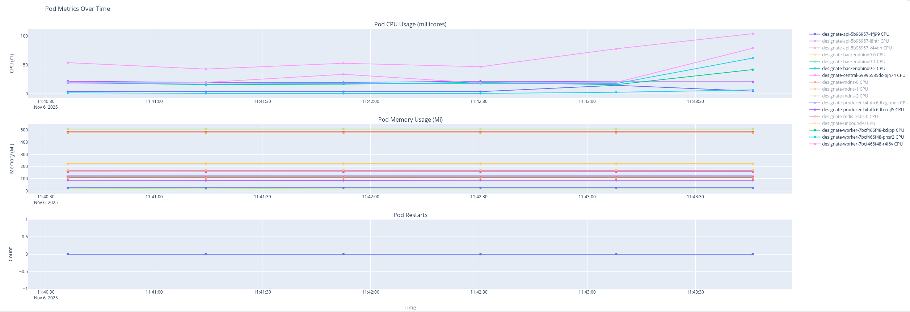

# OpenStack Tempest Test Runner with Pod Monitoring V1 

A Python-based tool for running OpenStack Tempest tests via OpenShift Custom Resources (CRs) with comprehensive pod monitoring and metrics collection.

## Features

- 🚀 **Parallel CR Management**: Apply and monitor multiple Tempest test CRs simultaneously
  - **Note**: Test-operator by default runs one test pod at a time. The tool can manage multiple CRs in parallel, but actual test execution is sequential per test-operator's design.
- 🔄 **Continuous Loop Testing**: Run tests continuously for a specified duration
- 📊 **Pod Monitoring**: Monitor pod status, CPU, and memory usage in real-time
- 📈 **Data Visualization**: Generate interactive graphs and static plots
- 💾 **CSV Export**: Export all metrics and results to CSV files
- 🔍 **Failed Test Tracking**: Automatically extract and track failed tests from pod logs
- ⏱️ **Test Execution Timing**: Track and visualize execution time for each individual test
- 🌐 **Web Report**: Auto-generate a beautiful HTML report ready for HTTP server hosting
- ✅ **Test Verification**: Automatically verify test results (PASS/FAIL)
- 🛡️ **Failure Handling**: Log failures without interrupting the test process
- ⏰ **Configurable Duration**: Set test run duration in hours
- 🎯 **Pod Pattern Matching**: Monitor specific pods using wildcard patterns

## Requirements

- Python 3.8+
- OpenShift CLI (`oc`) installed and configured
- Access to OpenShift/Kubernetes cluster with proper permissions
- OpenStack Platform 18 (OSP18) setup

## Installation

1. Clone this repository:
```bash
git clone https://github.com/zahlabut/RunTempestMonitorPods.git
cd RunTempestMonitorPods
```

2. Install dependencies:
```bash
pip install -r requirements.txt
```

3. Configure your OpenShift CLI:
```bash
oc login -u system:admin
oc project openstack
```

## Configuration

Edit `config.yaml` to customize the test runner:

```yaml
# List of CR files to run
cr_files:
  - "designate_neutron_integration_cr.yaml"
  - "designate_tempest_plugin_cr.yaml"

# Duration to run tests (in hours)
time_to_run_hours: 2

# Pod monitoring configuration
monitoring:
  namespace: "openstack"
  pod_patterns:
    - "designate-*"
  interval_seconds: 30

# OpenShift configuration
openshift:
  cr_timeout: 3600
  cr_namespace: "openstack"

# Output configuration
output:
  results_dir: "results"
  csv_filename: "tempest_monitoring"
  enable_graphs: true
  graph_format: "png"

# Logging
logging:
  level: "INFO"
  log_file: "tempest_runner.log"
```

### Configuration Parameters

| Parameter | Description | Default |
|-----------|-------------|---------|
| `cr_files` | List of Custom Resource YAML files to apply | `[]` |
| `time_to_run_hours` | Duration to run tests in hours | `2` |
| `monitoring.namespace` | Namespace where pods are running | `openstack` |
| `monitoring.pod_patterns` | Pod name patterns to monitor (supports wildcards) | `["designate-*"]` |
| `monitoring.interval_seconds` | How often to collect metrics | `30` |
| `openshift.cr_timeout` | Timeout for CR completion in seconds | `3600` |
| `openshift.cr_namespace` | Namespace where CRs are created | `openstack` |
| `output.results_dir` | Directory for output files | `results` |
| `output.enable_graphs` | Enable graph generation | `true` |
| `output.graph_format` | Graph format (png, svg, pdf) | `png` |
| `logging.level` | Log level (DEBUG, INFO, WARNING, ERROR) | `INFO` |

## Custom Resource Files

Create your CR files for the Tempest tests you want to run. Example CR files are provided:
- `designate_tempest_plugin_cr.yaml` - All Designate tempest plugin tests
- `designate_neutron_integration_cr.yaml` - Neutron-Designate integration tests from neutron tempest plugin

### Example CR Structure

```yaml
apiVersion: test.openstack.org/v1beta1
kind: Tempest
metadata:
  name: my-tempest-test
  namespace: openstack
spec:
  openStackConfigMap: openstack-config
  openStackConfigSecret: openstack-config-secret
  containerImage: quay.io/podified-antelope-centos9/openstack-tempest:current-podified
  includeList: |
    tempest.api.compute.test_servers
  parallel: true
  resources:
    requests:
      memory: "2Gi"
      cpu: "1000m"
    limits:
      memory: "4Gi"
      cpu: "2000m"
```

## Usage

### Basic Usage

Run with default configuration:

```bash
python main.py
```

### Custom Configuration

Run with a custom configuration file:

```bash
python main.py --config my_config.yaml
```

### Running in Background

Run the test runner in the background:

```bash
nohup python main.py > output.log 2>&1 &
```

### Graceful Shutdown

The tool supports graceful shutdown. Press `Ctrl+C` to stop:
- Current test runs will complete
- Final metrics will be collected
- Graphs will be generated
- Summary will be displayed

## Output

### Automatic Archiving

**Important**: The tool automatically manages the results directory:

- 📦 **On Startup**: Any existing result files are archived to `old_results_archive_{timestamp}.zip` and removed from the directory
- 📦 **On Completion**: All current results are packaged into `results_archive_{timestamp}.zip`
- 🧹 **Clean Workspace**: Each run starts with a clean results directory

This ensures you always have:
- Clean, organized results for the current run
- Archived history from previous runs
- Easy download via a single ZIP file

### Directory Structure

After running, the `results/` directory will contain:

```
results/
├── tempest_monitoring_metrics_20250105_143022.csv
├── tempest_monitoring_results_20250105_143022.csv
├── tempest_monitoring_failed_tests_20250105_143022.csv
├── tempest_monitoring_test_execution_times_20250105_143022.csv
├── pod_metrics_20250105_153045.html
├── pod_metrics_20250105_153045.png
├── test_results_20250105_153045.html
├── test_execution_times_20250105_153045.html
├── test_execution_times_20250105_153045.png
├── test_results_20250105_153045.png
├── web_report/                                   # HTTP server-ready report
│   ├── index.html                               # Main landing page
│   ├── graphs/                                  # Interactive HTML graphs
│   ├── csv/                                     # CSV data files
│   └── images/                                  # Static images
├── results_archive_20250105_143022.zip          # All current results
└── old_results_archive_20250105_140000.zip      # Previous run (if any)
```

### CSV Files

#### Metrics CSV (`*_metrics_*.csv`)

Contains pod monitoring data:

| Column | Description |
|--------|-------------|
| `timestamp` | When the metric was collected |
| `pod_name` | Name of the pod |
| `phase` | Pod phase (Running, Pending, etc.) |
| `ready` | Ready containers (e.g., "1/1") |
| `restarts` | Number of container restarts |
| `cpu` | CPU usage (e.g., "100m") |
| `memory` | Memory usage (e.g., "256Mi") |

#### Results CSV (`*_results_*.csv`)

Contains test results:

| Column | Description |
|--------|-------------|
| `timestamp` | When the test completed |
| `cr_name` | Name of the Custom Resource |
| `passed` | Whether the test passed (True/False) |
| `phase` | Test phase/status |
| `tests_passed` | Number of tests passed |
| `tests_failed` | Number of tests failed |
| `tests_skipped` | Number of tests skipped |
| `message` | Status message or error |

#### Failed Tests CSV (`*_failed_tests_*.csv`)

Contains detailed information about failed tests extracted from pod logs:

| Column | Description |
|--------|-------------|
| `timestamp` | When the failed test was detected |
| `iteration` | Test loop iteration number (1, 2, 3...) |
| `cr_name` | Name of the Custom Resource |
| `pod_name` | Name of the test pod |
| `test_number` | Test sequence number |
| `test_name` | Full test name (class.method) |
| `duration` | Test execution time |
| `logged_line` | Raw log line from pod (preserves original format) |

**Example:**
```csv
timestamp,iteration,cr_name,pod_name,test_number,test_name,duration,logged_line
2025-11-06T13:16:34.123456,1,tempest-neutron-dns-tests,pod-name,3,neutron_tempest_plugin.scenario.test_basic.NetworkBasicTest.test_ping_global_ip_from_vm_with_fip,222.489823s,"{3} neutron_tempest_plugin.scenario.test_basic.NetworkBasicTest.test_ping_global_ip_from_vm_with_fip [222.489823s] ... FAILED"
2025-11-06T13:35:21.789012,2,tempest-neutron-dns-tests,pod-name,3,neutron_tempest_plugin.scenario.test_basic.NetworkBasicTest.test_ping_global_ip_from_vm_with_fip,225.123456s,"{3} neutron_tempest_plugin.scenario.test_basic.NetworkBasicTest.test_ping_global_ip_from_vm_with_fip [225.123456s] ... FAILED"
```

This CSV helps identify patterns in test failures across multiple iterations. The **iteration column** allows you to:
- Track which iterations a specific test failed
- Identify if failures are consistent or intermittent
- Correlate failures with environmental changes

The **logged_line column** preserves the exact format from pod logs for reference and debugging.

#### Test Execution Times CSV (`*_test_execution_times_*.csv`)

Contains detailed execution timing for every test run, extracted from pod logs:

| Column | Description |
|--------|-------------|
| `timestamp` | When the test execution was recorded |
| `iteration` | Test loop iteration number (1, 2, 3...) |
| `cr_name` | Name of the Custom Resource |
| `pod_name` | Name of the test pod |
| `test_number` | Test sequence number |
| `test_name` | Full test name (class.method) |
| `duration_seconds` | Test execution time in seconds |
| `status` | Test result (PASSED, FAILED, SKIPPED, OK) |

**Example:**
```csv
timestamp,iteration,cr_name,pod_name,test_number,test_name,duration_seconds,status
2025-11-06T13:16:34.123456,1,tempest-neutron-dns-tests,pod-name,0,setUpClass (neutron_tempest_plugin.scenario.test_dns_integration.DNSIntegrationTests),0.0,FAILED
2025-11-06T13:16:34.123456,1,tempest-neutron-dns-tests,pod-name,1,neutron_tempest_plugin.scenario.test_dns_integration.DNSIntegrationTests.test_dns_integration,45.23,PASSED
2025-11-06T13:17:21.456789,2,tempest-neutron-dns-tests,pod-name,1,neutron_tempest_plugin.scenario.test_dns_integration.DNSIntegrationTests.test_dns_integration,47.89,PASSED
```

This CSV enables powerful analysis:
- Compare test execution times across iterations
- Identify slow tests that need optimization
- Detect performance regressions (increasing execution times)
- Track test timing trends over multiple runs
- Correlate timing with pass/fail status

### Graphs

The tool generates interactive HTML graphs and static images for visualization.

#### Pod Metrics Graph

Interactive HTML graph showing:
- **CPU usage over time** (per pod) - Track resource consumption
- **Memory usage over time** (per pod) - Monitor memory footprint
- **Container restarts over time** (per pod) - Detect stability issues

The graph displays multiple pods on a single interactive chart with:
- Individual lines for each pod being monitored
- Hover tooltips showing exact values at any point in time
- Zoom and pan capabilities for detailed analysis
- Legend to show/hide specific pods
- Time-series data captured at configured intervals

**Example Graph:**



**What to look for in the graph:**
- 📈 **Steady CPU/Memory**: Normal test execution
- 🔴 **Spikes in CPU/Memory**: Heavy operations or potential issues
- ⚠️ **Increasing restarts**: Pod stability problems
- 📊 **Patterns over iterations**: Performance consistency

#### Test Results Graph

Interactive HTML graph showing:
- **Pass/Fail status timeline** - Visual test success tracking
- **Test counts** (passed, failed, skipped) - Detailed breakdown per iteration

**Example**: Generated as `test_results_YYYYMMDD_HHMMSS.html`

The graph visualizes:
- Bar charts for pass/fail/skip counts per iteration
- Color-coded status indicators (green=pass, red=fail, yellow=skip)
- Success rate trends over multiple iterations
- Iteration timing and duration

**What to look for in the graph:**
- ✅ **Consistent passes**: Stable test suite
- ❌ **Failed tests**: Investigation needed
- 📉 **Degrading success rate**: Potential environment issues

#### Test Execution Times Graph

Interactive HTML graph showing:
- **Execution time per test** - Bar chart visualization
- **Color-coded by status** - Green (PASSED), Red (FAILED), Orange (SKIPPED)
- **Iteration tracking** - Compare timing across multiple runs

**Example**: Generated as `test_execution_times_YYYYMMDD_HHMMSS.html`

The graph visualizes:
- Bar charts showing execution duration in seconds for each test
- Grouped by test name with color-coded status
- Hover tooltips showing exact duration and iteration number
- Comparison of test timing across iterations

**What to look for in the graph:**
- ⏱️ **Slow tests**: Tests with high execution times that may need optimization
- 📈 **Performance trends**: Increasing execution times over iterations may indicate resource issues
- ⚡ **Fast failures**: Tests that fail quickly may indicate setup/configuration issues
- 🔄 **Timing consistency**: Stable execution times indicate reliable test environment

All graphs are also exported as static images (PNG/SVG/PDF).

### Web Report (HTTP Server Ready)

The tool automatically generates a **web-ready report** in `results/web_report/` with a professional HTML interface:

#### Directory Structure
```
results/web_report/
├── index.html              # Main landing page
├── graphs/                 # Interactive HTML graphs
│   ├── pod_metrics_*.html
│   ├── test_results_*.html
│   └── test_execution_times_*.html
├── csv/                    # All CSV data files
│   ├── tempest_monitoring_metrics_*.csv
│   ├── tempest_monitoring_results_*.csv
│   ├── tempest_monitoring_failed_tests_*.csv
│   └── tempest_monitoring_test_execution_times_*.csv
└── images/                 # Static images (PNG, SVG, PDF)
    ├── pod_metrics_*.png
    ├── test_results_*.png
    └── test_execution_times_*.png
```

#### Features of the Web Report

✨ **Professional Interface**
- Beautiful gradient design with responsive layout
- Summary cards showing total runs, passed, failed, and success rate
- Organized sections for graphs, CSV files, and images
- Mobile-friendly responsive design

📊 **Interactive Graphs Section**
- Direct links to all HTML interactive graphs
- Descriptive titles and explanations for each graph
- Opens in new tabs for easy navigation

📁 **CSV Downloads**
- One-click download buttons for all CSV files
- Clear descriptions of each dataset
- Organized and easy to access

🖼️ **Image Previews**
- Embedded PNG previews for quick visualization
- Download links for all image formats (PNG, SVG, PDF)

#### How to Use the Web Report

1. **After test completion**, find the web report at:
   ```
   results/web_report/index.html
   ```

2. **Upload to HTTP server**:
   ```bash
   # Example using scp to upload to web server
   scp -r results/web_report/ user@webserver:/var/www/html/tempest-results/
   
   # Or using rsync
   rsync -av results/web_report/ user@webserver:/var/www/html/tempest-results/
   ```

3. **Access via browser**:
   ```
   http://your-server.com/tempest-results/index.html
   ```

4. **Share with team**:
   - Email the URL to stakeholders
   - Embed in CI/CD dashboards
   - Link from project documentation

#### Benefits

✅ **Professional Presentation**: Impress stakeholders with a polished report  
✅ **Easy Sharing**: Just upload and share a URL  
✅ **No Dependencies**: Pure HTML/CSS, works on any web server  
✅ **Self-Contained**: All files organized and ready to deploy  
✅ **Interactive**: Team members can explore graphs and download data  

### Downloading Result Files

After the test run completes, a **single download command** is displayed in color:

```bash
============================================================
DOWNLOAD COMMAND FOR RESULTS ARCHIVE
============================================================
All results are packaged in a single ZIP file.
Copy and paste this command on your local desktop:
(Replace <your_bastion_host> with your actual bastion hostname)

# Download all results (ZIP archive):
ssh root@<your_bastion_host> "su - zuul -c 'ssh -q controller-0 \"base64 /path/to/results_archive_20251106_143022.zip\"'" | base64 -d > results_archive_20251106_143022.zip

Note: Using base64 encoding to safely transfer binary ZIP file

Archive contains: CSV files, HTML graphs, and PNG images
Archive size: 2.85 MB
Archive location: /path/to/results_archive_20251106_143022.zip
============================================================
```

**Benefits:**
- ✅ Single command to download everything
- ✅ Base64 encoding prevents file corruption
- ✅ All results (CSV, HTML, PNG) in one ZIP
- ✅ Colored output for easy visibility

Simply copy and execute the command, then extract: `unzip results_archive_*.zip`

## Architecture

### Components

```
main.py              # Main orchestrator
├── pod_monitor.py   # Pod metrics collection
├── cr_handler.py    # CR lifecycle management
└── csv_exporter.py  # Data export and visualization
```

### Workflow

1. **Initialization**: Load configuration, setup logging, initialize components
2. **Monitoring Start**: Begin collecting pod metrics in background thread
3. **Test Loop**: 
   - Apply CRs in parallel
   - Wait for completion
   - Verify results
   - Log and export data
   - Repeat until time limit
4. **Shutdown**: 
   - Stop monitoring
   - Generate graphs
   - Display summary

## Troubleshooting

### Common Issues

#### "oc command not found"

Install OpenShift CLI:
```bash
# Download from https://mirror.openshift.com/pub/openshift-v4/clients/ocp/
# Or use your package manager
sudo dnf install openshift-clients  # Fedora/RHEL
```

#### "Failed to get pods: Forbidden"

Ensure you have proper RBAC permissions:
```bash
oc auth can-i get pods -n openstack
oc auth can-i create tempest -n openstack
```

#### "No metrics available"

The `oc adm top` command requires metrics-server to be running:
```bash
oc get deployment metrics-server -n openshift-monitoring
```

#### CR not completing

Check CR timeout in config and verify CR status:
```bash
oc get tempest -n openstack
oc describe tempest <cr-name> -n openstack
```

### Debug Mode

Enable debug logging in `config.yaml`:
```yaml
logging:
  level: "DEBUG"
```

## Advanced Usage

### Custom Pod Patterns

Monitor multiple pod types:
```yaml
monitoring:
  pod_patterns:
    - "designate-*"
    - "neutron-*"
    - "nova-*"
    - "tempest-*"  # Include test pods
```

### Long-Running Tests

For tests running longer than the default timeout:
```yaml
openshift:
  cr_timeout: 7200  # 2 hours
```

### High-Frequency Monitoring

For more granular metrics:
```yaml
monitoring:
  interval_seconds: 10  # Collect every 10 seconds
```

### Parallel Test Execution Limitations

**Important**: While this tool can manage multiple CRs simultaneously, the OpenStack test-operator has a limitation:

- **Test-operator default behavior**: Runs only one test pod at a time
- **Tool behavior**: Can apply and monitor multiple CRs in parallel, but test execution will be sequential
- **Workaround**: Configure multiple CR files; the tool will automatically manage them in sequence and restart them in iterations

**How it works**:
1. Tool applies all CRs from `cr_files` list
2. Test-operator queues them and runs one at a time
3. Tool monitors all CRs and detects completion (even if pod is in Error state)
4. After completion, tool cleans up and starts the next iteration
5. Process repeats for the configured duration

This design ensures continuous testing without manual intervention, even with test-operator's sequential execution model.

## Contributing

Contributions are welcome! Please feel free to submit a Pull Request.

## License

This project is provided as-is for use with OpenStack deployments.

## Authors

Created for OSP18 Tempest testing and pod monitoring.

## Acknowledgments

- OpenStack Tempest Project
- OpenShift/Kubernetes Community
- Designate Team

